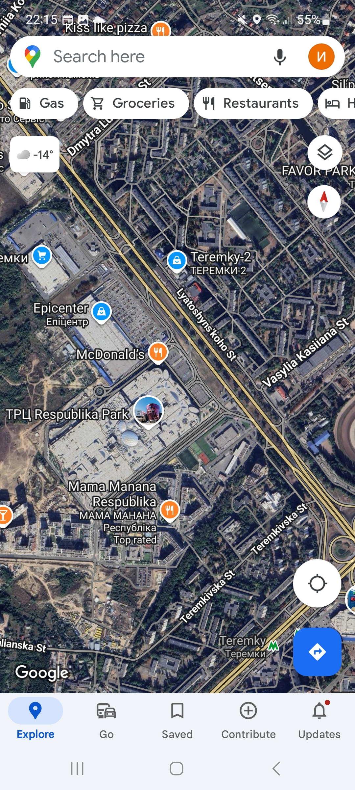

# Bug-report ID: BR_002

## Title: No navigation and address information for specific theater  when pressing navigation icon
----

## Environment: PC (Windows 10 Pro), Samsung Galaxy A51 (Android 13, OneUI 5.1), Multiplex Application v1.14.2, Google Maps v 11.119.0101

## Related Test Case: [TC_6](../../Multiplex_App_Testing/Test-Cases/TC_6_Navigation_test.md)

----

## Preconditions: 
- Devices with specific software are available.
- Stable internet connection
- Multiplex and Google Maps applications are available 
- Precondition are the same as in [TC_6](../../Multiplex_App_Testing/Test-Cases/TC_6_Navigation_test.md). 

## Steps to Reproduce: 

1. Open the application. 
2. Open the burger menu in the upper left corner.
3. On the bottom of burger menu tap the navigation icon to cinema.
4. Observe the displayed screen. 
 

----

## Actual Result:  

- The application opens Google maps.
- Navigation to cinema is not available.
- The specific spot on map is not shown. The route to the cinema was not built.
- No info about address of choosen cinema 

## Expected Result:

- The app open maps and build a route to the cinema.
- You can see an adress of specific cinema in maps app

----

## Severity: Medium

## Priority: Medium

## Attachments: 

1.Burger menu 
2.Navigation Icon 
3.Google maps 
