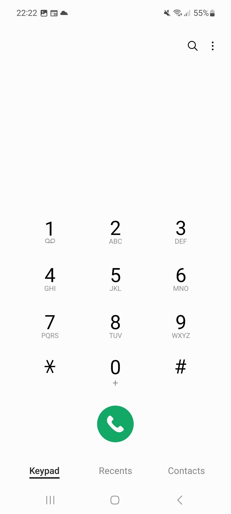
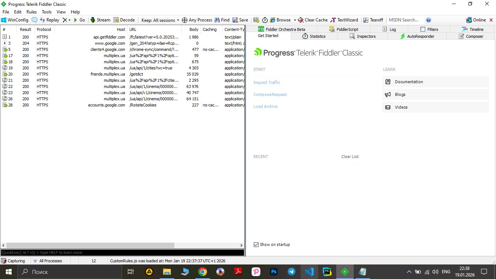

# Bug-report ID: BR_003

## Title: Dialer opens with empty field, when trying to call to the cinema. No API request to server from application.
----

## Environment: PC (Windows 10 Pro), Samsung Galaxy A51 (Android 13, OneUI 5.1, Google Maps v 11.119.0101, Phone v 14.7.09),
Multiplex Application v1.14.2, Fiddler Classic v5.0.20253.3311 

## Related Test Case: [TC_7](../../Multiplex_App_Testing/Test-Cases/TC_7_Make_a_call_to_the_cinema.md)

----

## Preconditions: 
- Devices with specific software are available.
- Stable internet connection
- Multiplex and Google Maps applications are available 
- Fiddler is installed and proxy is configured. 
- Precondition are the same as in [TC_7](../../Multiplex_App_Testing/Test-Cases/TC_7_Make_a_call_to_the_cinema.md). 

## Steps to Reproduce: 

1. Open fiddler on PC. 
2. Open the Multiplex application. 
3. Open the burger menu in the upper left corner.
4. On the bottom of burger menu tap the phone icon.
5. Observe the displayed screen on mobile phone. 
6. Observe responses and requests in Fiddler.
 

----

## Actual Result:  

- The application opens empty dialer.
- Network sniffig with Fiddler shows that there is no API requests or responses while tapping on mobile phone icon.

## Expected Result:

- The app opens Google maps and build a route to the cinema.
- You can see an adress of specific cinema in Google Maps

----

## Severity: Medium

## Priority: High

## Attachments: 

1. Burger menu 
2. Phone icon 
3. Empty dealer 
4. Fiddler sniffing 
