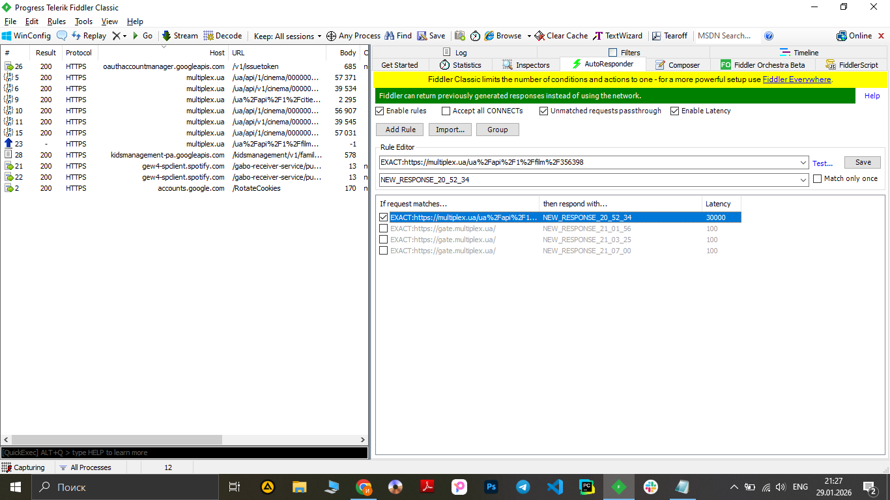

# Test Case ID: TC_10
## Title: How application reacts to high latency
----

- Type of testing: Non-functional

- Test Object: Application behavior to high network latency

- Test Type: Negative

----

## Preconditions:
1. Mobile phone on Android platform is available and ready to use.
2. Fiddler on PC is installed and configured.
3. Stable connection to Wi-Fi network, internet connection is available, proxy is configured.
3. [Multiplex](https://play.google.com/store/apps/details?id=com.interpretator.multiplex&hl=en) application is installed.

## Steps:
1. Launch the Multiplex application.
2. Start Fiddler and enable traffic capturing.
3. In the Multiplex application, select any film session to generate network requests.
4. In Fiddler, identify response related to the selected session.
5. Change latency to 30000 in response. 
6. Return to the Multiplex application.
7. Repeat the action of opening the same film session.
8. Observe the application behavior.

## Expected Result:

- Application shows message “Request timed out. Please try again.”   
- Application doesn't crashes. 

## Actual Result:

- App shows message request timed out and suggest to refresh the page. 
- Behavior of appliction is predictable and as expected 

- **Status**: Pass 

## Screenshots: 

1. Choose a session 
2. Fiddle latency 
3. Request timed out 
