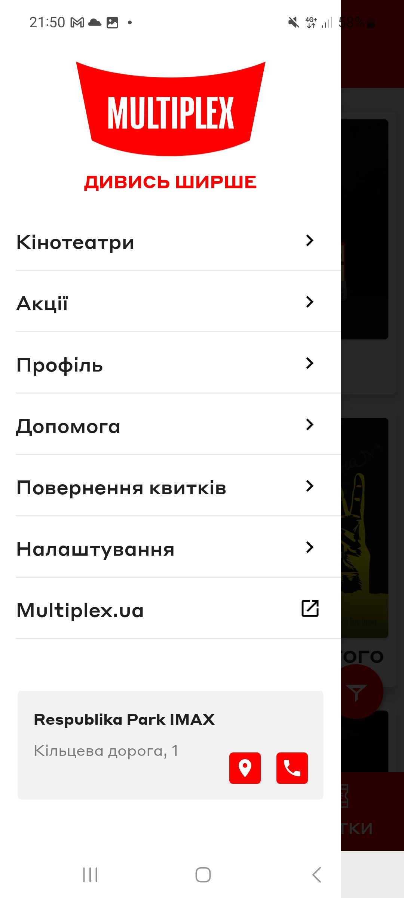
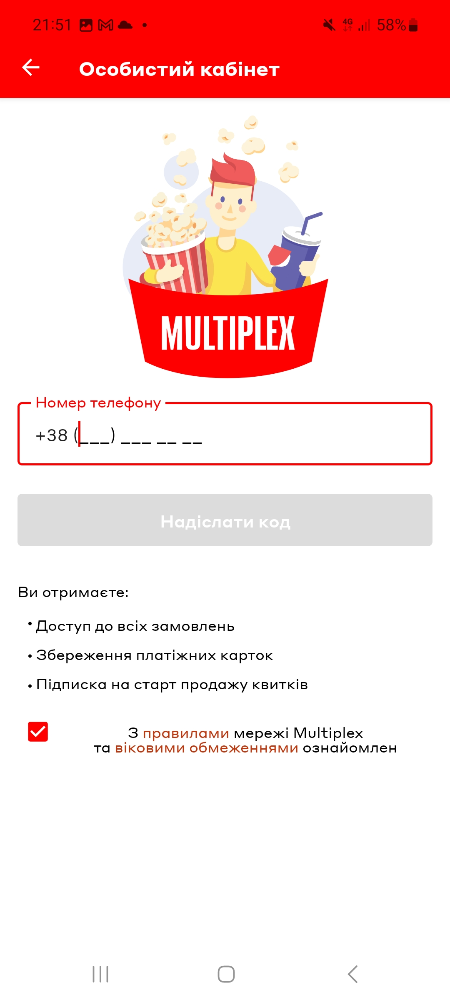
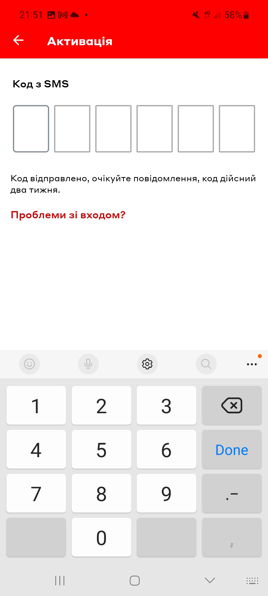
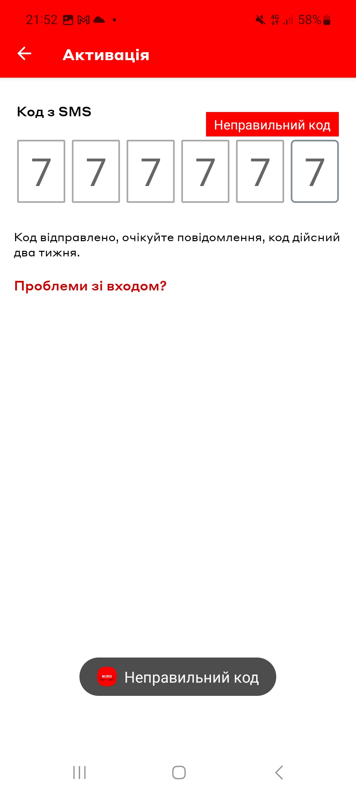

# Test Case ID: TC_11
## Title: Try to log in with wrong OTP code
----

- Type of testing: Functional

- Test Object: Multiplex application logging in/security

- Test Type: Negative 

----

## Preconditions:
1. Mobile phone on Android platform is available and ready to use.
2. Stable connection to Wi-Fi network, internet connection is available.
3. [Multiplex](https://play.google.com/store/apps/details?id=com.interpretator.multiplex&hl=en) application is installed.
4. The user is registered, logged out and OTP code is not expired.

## Steps:
1. Open the Multiplex application. 
2. Open the burger menu in the upper left corner.
3. Press "Профіль" tab.
4. Type in your phone number which already registered in the system, press "Надіслати код".
5. In the field where OTP code is required, type in wrong code 
6. Observe application behavior. 

## Expected Result:

- Application shows message “Wrong code”
- You are not log in. 

## Actual Result:

- Application shows message “Wrong code”.
- Behavior of application is as expected. 

- **Status**: Pass

## Vocabulary: 

- "Профіль" = Profile 
- "Надіслати код" = Send a code 

## Screenshots: 

1. Burger menu profile 
2. Phone number 
3. OTP code field 
4. Wrong code message 
