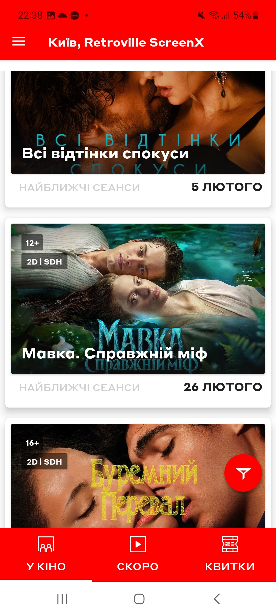
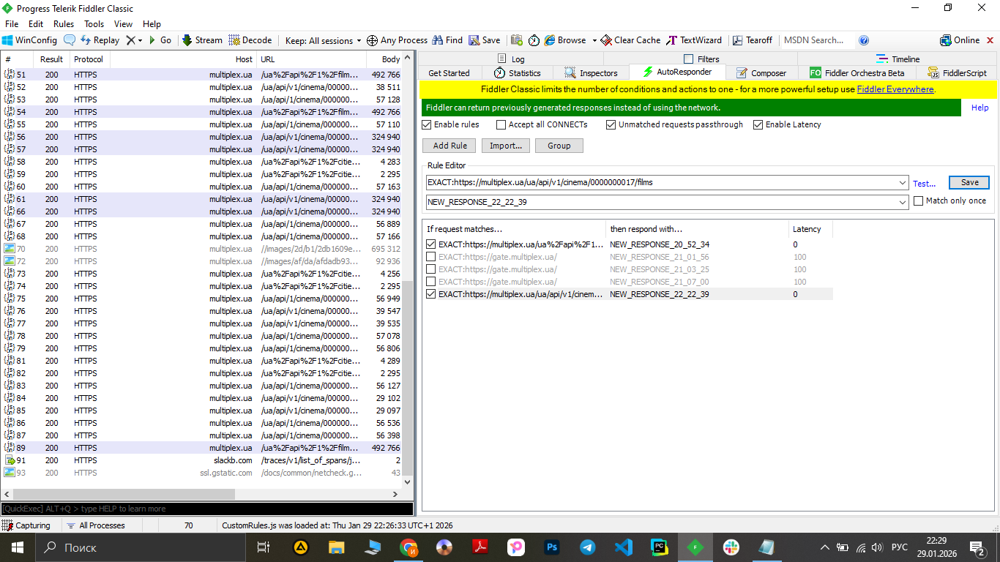
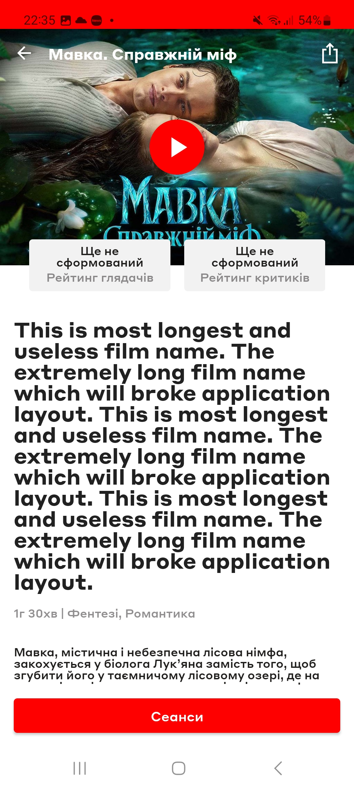

# Test Case ID: TC_12
## Title: UI behavior with excessively long movie title
----

- Type of testing: Non-functional

- Test Object: Application layout handling for long movie titles

- Test Type: Negative

----

## Preconditions:
1. Mobile phone on Android platform is available and ready to use.
2. Fiddler on PC is installed and configured.
3. Stable connection to Wi-Fi network, internet connection is available, proxy is configured.
3. [Multiplex](https://play.google.com/store/apps/details?id=com.interpretator.multiplex&hl=en) application is installed.

## Steps:
1. Launch the Multiplex application.
2. Start Fiddler and enable traffic capturing.
3. In the Multiplex application, select any film session to generate network requests.
4. In Fiddler, identify response related to the selected session.
5. Using fiddler in response change name of film session to a very long (from 300 to 400 characters) 
6. Return to the Multiplex application.
7. Repeat the action of opening the same film session.
8. Observe the application behavior.

## Expected Result:

- UI does not break; the application is still usable

## Actual Result:

- The appliction layout is ok with long film names. 
- UI is not affected. 

- **Status**: Pass 

## Screenshots: 
1. Choosing the film 
2. Changing name of film with Fiddler 
3. Result  
