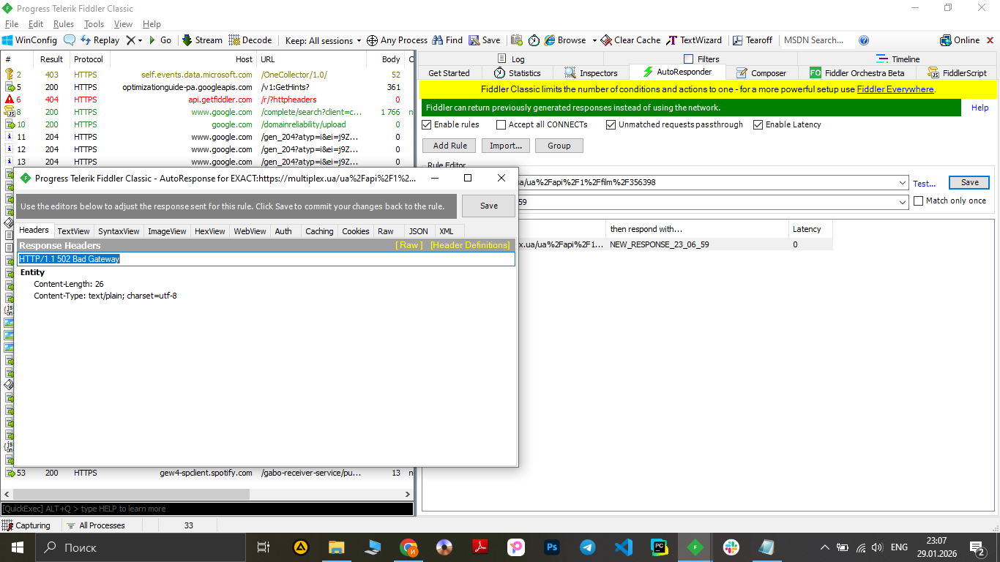
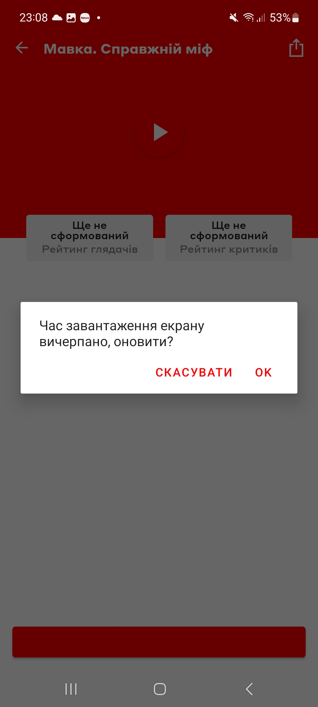

# Test Case ID: TC_13
## Title: Simulate server response 500 instead of 200
----

- Type of testing: Non-functional

- Test Object: Application handling to unexpected server responses 

- Test Type: Negative

----

## Preconditions:
1. Mobile phone on Android platform is available and ready to use.
2. Fiddler on PC is installed and configured.
3. Stable connection to Wi-Fi network, internet connection is available, proxy is configured.
3. [Multiplex](https://play.google.com/store/apps/details?id=com.interpretator.multiplex&hl=en) application is installed.

## Steps:
1. Launch the Multiplex application.
2. Start Fiddler and enable traffic capturing.
3. In the Multiplex application, select any film session to generate network requests.
4. In Fiddler, identify response related to the selected session.
5. Using fiddler in response change response code from 200 "Successful HTTP request" to 502 "Bad Gateway"
6. Return to the Multiplex application.
7. Repeat the action of opening the same film session.
8. Observe the application behavior.

## Expected Result:

- The app does not crash and shows a 502 Bad Gateway message

## Actual Result:

- The application shows "Request timed out" message and propose to "Retry" or "Cancel" 
- From the point of UX, application behavior even better from expected 

- **Status**: Pass 

## Screenshots: 
1. Changing API response with Fiddler 
2. Result with changed response 
