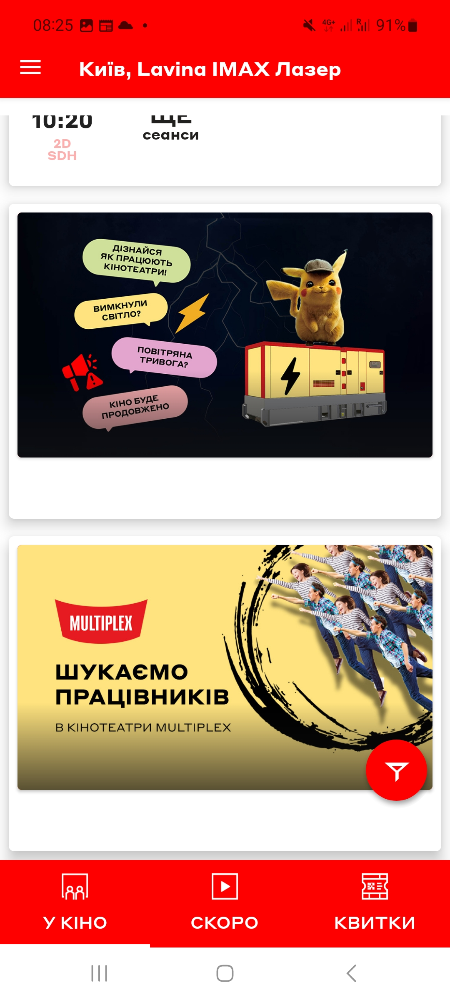

# Test Case ID: TC_2
## Title: Open the app, close it, and minimize it
----

- Type of testing: Smoke

- Test Object: Multiplex mobile app

- Test Type: Positive 

----

## Preconditions:
1. Mobile phone on Android platform is available and ready to use.
2. Stable connection to Wi-Fi network, internet connection is available.
3. [Multiplex](https://play.google.com/store/apps/details?id=com.interpretator.multiplex&hl=en) application is installed 

## Steps:
1. Open the application, by pressing on app icon.
2. After opening swipe the main screen down to the bottom of the page and than to the top.
3. Minimize the app and open it again. 
4. Try to split screen the app.
5. Close application.

## Expected Result:

- The app opens, closes, and minimizes correctly. App does not crash

## Actual Result:

- Apllication reacts as expected.
- Everything works correctly, no frizes or crashes of the application. 
- Behavior of application is predictable and expected. 	

- **Status**: Pass 

## Screenshots:
1. App icon
2. Swiping to the bottom
3. Swiping to the top
4. App minimizing
5. Split-screen 

