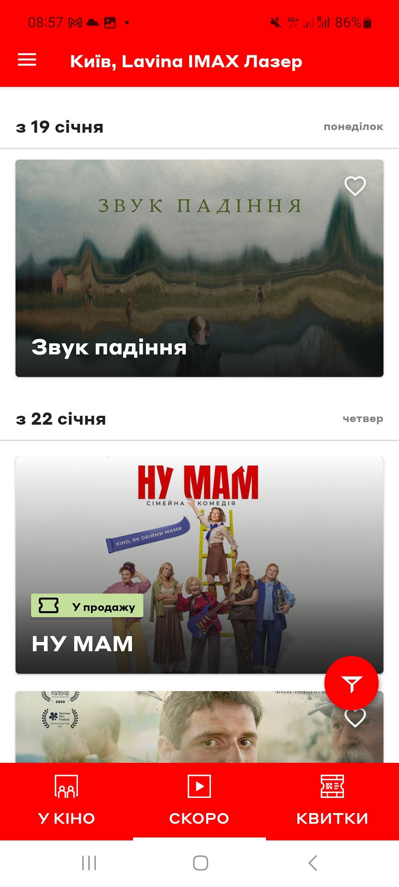
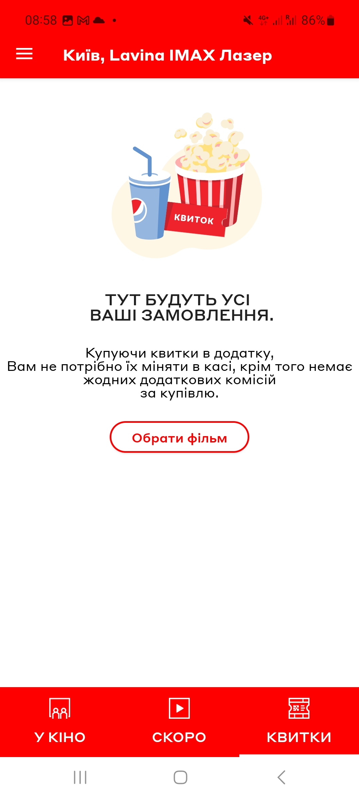
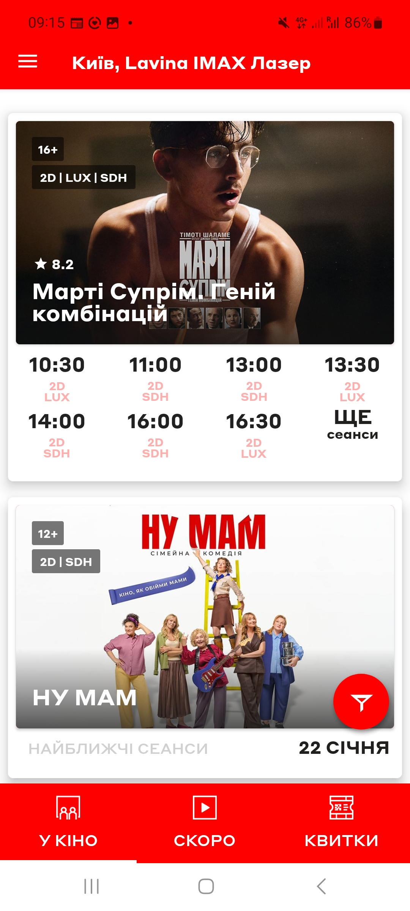
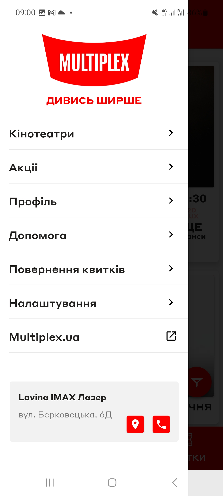

# Test Case ID: TC_3
## Title: Main page UI testing: tabs “у кіно”, “скоро”, “квитки”, Filters button, burger menu
----

- Type of testing: UI testing

- Test Object: Multiplex mobile app main screen

- Test Type: Positive 

----

## Preconditions:
1. Mobile phone on Android platform is available and ready to use.
2. Stable connection to Wi-Fi network, internet connection is available.
3. [Multiplex](https://play.google.com/store/apps/details?id=com.interpretator.multiplex&hl=en) application is installed 

## Steps:
1. Open the application, by pressing on app icon.
2. Press "скоро" button. The "скоро" tab opens and relevant content is displayed.
3. Press "квитки" button. The "квитки" tab opens and ticket options are displayed.
4. Press "у кино" button. The "у кино" tab opens, available sessions are displayed.
5. Tapp filters icon. Available filters for films are shown.
6. Open the burger menu in the upper left corner. The burger menu opens and menu items are clickable

## Expected Result:

- Buttons respond correctly and screens display as expected.

## Actual Result:

- Apllication reacts as expected.
- Pressing of buttons looks smooth without any freezes in application. 
- Everything works correctly.  
- The context of the buttons is as expected.

- **Status**: Pass 

## Vocabulary: 

- **у кіно** – *in the cinema*  
- **скоро** – *soon*  
- **квитки** – *tickets*  
- **фільтри** – *Filters*

## Screenshots: 

1."Скоро" button
2."квитки" button
----
3."у кино" button
4.Filters icon
----
5.Burger menu

