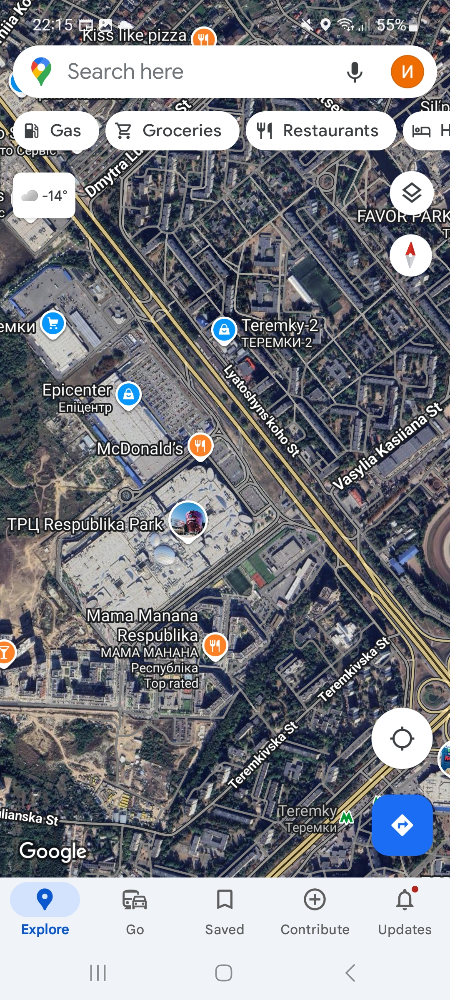

# Test Case ID: TC_6
## Title: Test navigation to cinema theaters. Network sniffing
----

- Type of testing: Navigation

- Test Object: Navigation to the cinema. Network sniffing

- Test Type: Positive 

----

## Preconditions:
1. Mobile phone on Android platform is available and ready to use.
2. Stable connection to Wi-Fi network, internet connection is available.
3. [Multiplex](https://play.google.com/store/apps/details?id=com.interpretator.multiplex&hl=en) application is installed
4. Google maps are available, location is turn on. 

## Steps:
1. Open the application. 
2. Open the burger menu in the upper left corner.
3. On the bottom of burger menu tap the navigation icon to cinema.
4. Observe the displayed screen. 

## Expected Result:

- The app opens maps and displays route to the cinema

## Actual Result:

- The application opens Google maps.
- Navigation to cinema is not available.
- The specific spot on map is not shown. The route to the cinema was not built.

- **Status**: Fail 

## Screenshots: 
1.Burger menu 
2.Navigation Icon 
3.Google maps 
