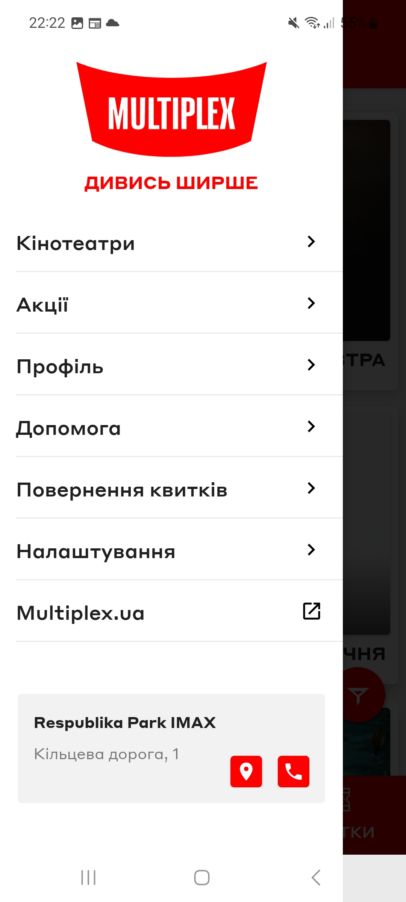

# Test Case ID: TC_7
## Title: Make a call to the cinema from the application. Network sniffing
----

- Type of testing: Integration

- Test Object: Verify integration witj dealer. See how server responses on request

- Test Type: Positive 

----

## Preconditions:
1. Mobile phone on Android platform is available and ready to use.
2. Fiddler on PC is installed and configured.
3. Stable connection to Wi-Fi network, internet connection is available, proxy is configured.
4. [Multiplex](https://play.google.com/store/apps/details?id=com.interpretator.multiplex&hl=en) application is installed.

## Steps:
1. Open fiddler on PC. 
2. Open the Multiplex application. 
3. Open the burger menu in the upper left corner.
4. On the bottom of burger menu tap the phone icon.
5. Observe the displayed screen on mobile phone. 
6. Observe responses and requests in Fiddler.

## Expected Result:

- The application opens dialer.
- You see a phone number on the screen of your device and it is possible to make a call.

## Actual Result:

- The application opens empty dealer.
- Fiddler shows tha there is no requests or responses while tapping on mobile phone icon.

- **Status**: Fail 

## Screenshots: 

1. Burger menu 
2. Phone icon 
3. Empty dealer 

4. Fiddler sniffing 
