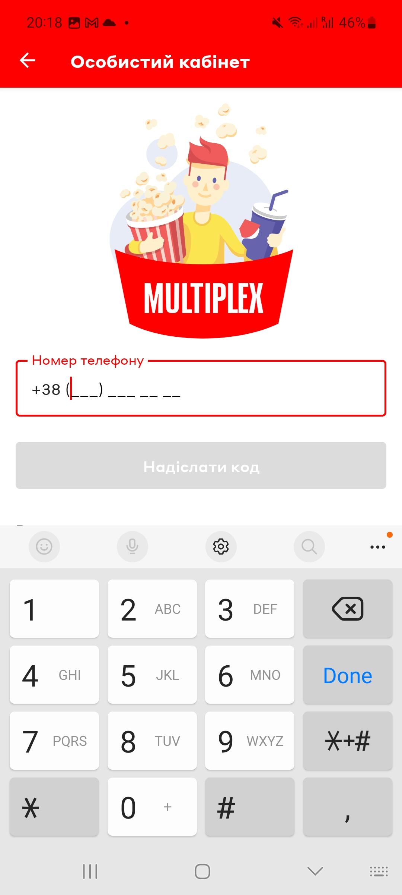
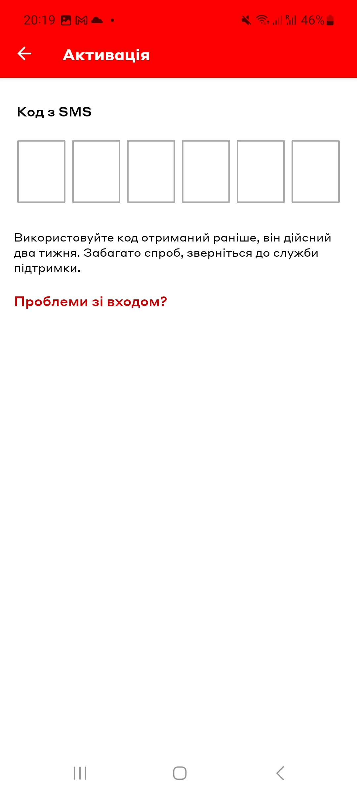
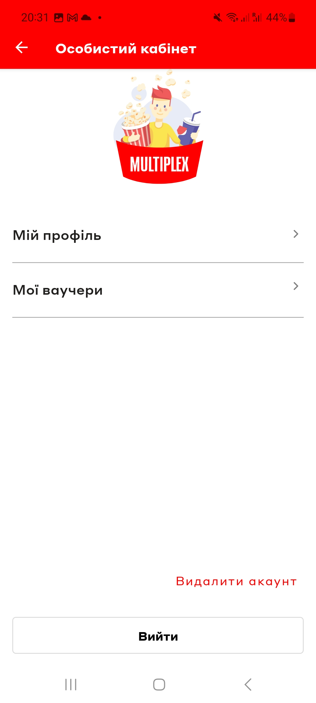

# Test Case ID: TC_8
## Title: Create a profile and sign in
----

- Type of testing: Functional

- Test Object: Multiplex app registration 

- Test Type: Positive 

----

## Preconditions:
1. Mobile phone on Android platform is available and ready to use.
2. Stable connection to Wi-Fi network, internet connection is available.
3. [Multiplex](https://play.google.com/store/apps/details?id=com.interpretator.multiplex&hl=en) application is installed.

## Steps:
1. Open the Multiplex application. 
2. Open the burger menu in the upper left corner.
3. Press "Профіль" tab.
4. Type in your mobile phone number, and press "Надіслати код".
5. After redirecting to activation, wait for sms with OTP-code. 
6. Type in received code (it will be valid for two weeks) 
7. After redirecting to "Особистий кабінет", check "Мій профіль" tab.
8. Observe the displayed screen. 

## Expected Result:

- OTP-code was received.
- Registration is successful
- Everything still works, app doesnt crashes.

## Actual Result:

- OTP-code was received with dealy ( 1 min. approx)
- Registration was sucessfull.
- After redirecting to "Особистий кабінет", app freezes and doesn't respond to taps.

- **Status**: Fail 

## Vocabulary: 

- **Профіль** = Profile 
- **Надіслати код** = Send a code 
- **Особистий кабінет** = Personal cabinet
- **Мій профіль** = My profile

## Screenshots: 

1. Burger menu and "Профіль" tab
2. Phone number typng
3. Activation with OTP
4. My Profile
