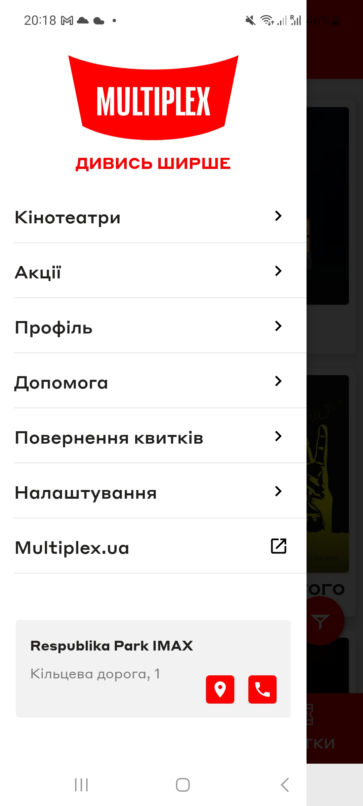

# Test Case ID: TC_9 
## Title: Edit profile (change name, surname, email)
----

- Type of testing: Functional

- Test Object: Multiplex app 

- Test Type: Positive 

----

## Preconditions:
1. Mobile phone on Android platform is available and ready to use.
2. Stable connection to Wi-Fi network, internet connection is available.
3. Multiplex application is installed.
4. The user is registered and logged in.

## Steps:
1. Open the Multiplex application. 
2. Open the burger menu in the upper left corner.
3. Press "Профіль" tab.
4. Press "Мій профіль" tab. 
5. Fill in your personal data such as name, surname, and email.
6. Fill in all fields (optional)

## Expected Result:

- Application acccept changes to your profile. 
- App sends a confirmation letter to your email adres when you trying to change email.
- App does not crash and responds to taps.

## Actual Result:

- Application freezes when you try to open "Мій профіль" tab. 

- **Status**: Blocker 

## Vocabulary: 

- "Профіль" = Profile 
- "Мій профіль" = My profile

## Screenshots: 

1. Burger menu and Profile tab 
2. My Profile 
