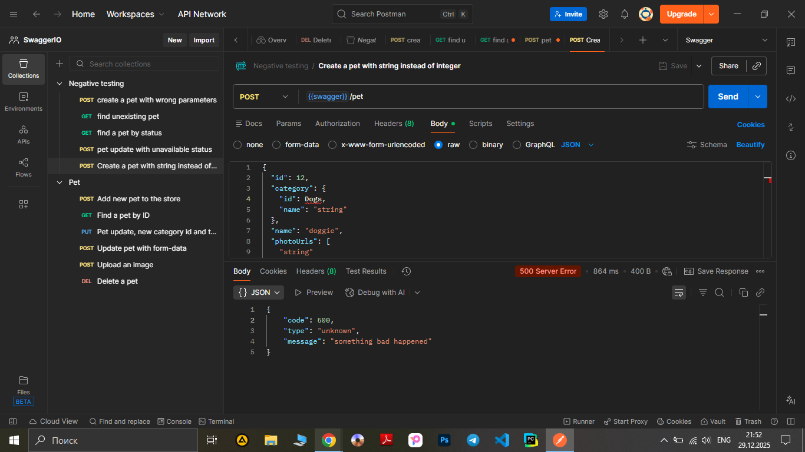

# Title: POST request for creating a new pet with strings instead of integers returns code 500.
## Bug ID: SWAG-15
***Link to [Jira](https://igor2012lww.atlassian.net/browse/SWAG-15?atlOrigin=eyJpIjoiMWEwZTM1NGJhN2FjNDFlZGIxODVlZTEwY2U4Y2UwOGMiLCJwIjoiaiJ9)***

## Environment: Windows 10 PRO;  Postman  v11.77.2; API Documentation & Design Tools for Teams | Swagger

## Related Test Case: [TCN_05](../../SwaggerPetstore_Testing/Test_Cases/Negative/TCN_05_string_instead_of_integers.md)

----

## Preconditions: 

- Api is running. 
- Preconditions are the same as in test-case [TCN_05](../../SwaggerPetstore_Testing/Test_Cases/Negative/TCN_05_string_instead_of_integers.md)

## Steps to Reproduce: 

1. Prepare a POST request to /pet 
2. Use following json body:
```json
{
  "id": 12,
  "category": {
    "id": "Dogs",
    "name": "string"
  },
  "name": "doggie",
  "photoUrls": [
    "string"
  ],
  "tags": [
    {
      "id": 0,
      "name": "string"
    }
  ],
  "status": "available"
}
```
(category id string instead of integer).

3. Execute the request and observe the response.

----

## Actual Result:  
Response code: 500 'The server has encountered a situation it does not know how to handle'
```
{
    "code": 500,
    "type": "unknown",
    "message": "something bad happened"
}
```

## Expected Result: Response code: 405 ‘Invalid iput’

----

- Severity: Medium

- Priority: Medium

----

## Screenshot: 


