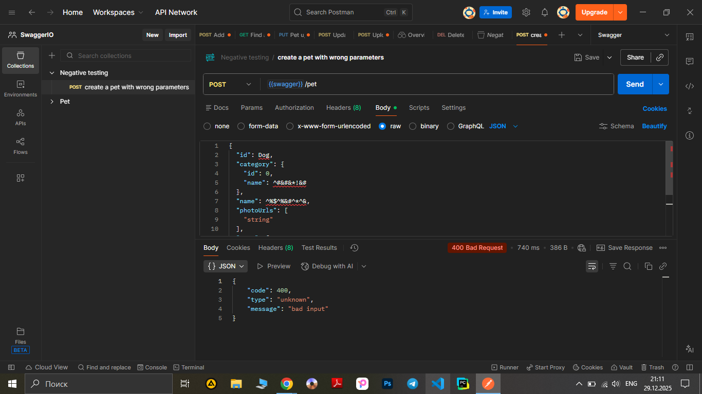

# Test Case ID: TCN_01

## Title: Add a new pet to the store entering invalid data to one of / several / all the fields.

***Link to [Jira](https://igor2012lww.atlassian.net/browse/SWAG-8?atlOrigin=eyJpIjoiY2YxNmZlZjBmM2Q3NDhhNjgzNzVmOTM3NDY3YWRmNmQiLCJwIjoiaiJ9)***

----

- Type of testing: Functional
- Test Object: API
- Test Type: Negative

----

## Preconditions:

1. Postman is installed on computer. 
2. Create an environment with variable "swagger" and put in a link "https://petstore.swagger.io/v2".
3. Create a "Negative testing" folder in Collections.
4. "https://petstore.swagger.io/" is available and opened to check documentation.

## Steps:

1. Add a new request to "Negative testing" folder.
2. Name the request "Create a pet with wrong parameters" 
3. Change method to "POST"
4. Print to URL-field variable {{swager}} and add /pet in the end. 
5. Open body, chose "raw" and paste an object(using a special symbols instead of strings in "name" parameters):
```json
{
  "id": Dog,
  "category": {
    "id": 0,
    "name": ^#&#&*!&#
  },
  "name": ^%$^%&#^*^&,
  "photoUrls": [
    "string"
  ],
  "tags": [
    {
      "id": 0,
      "name": "string"
    }
  ],
  "status": "available"
}
```

6. Press the button "Send" observe a response body and status code.

----

## Expected Result:

Code 405 ‘Invalid input’

## Actual Result:

Code 400 ‘Bad request’
```json
{
    "code": 400,
    "type": "unknown",
    "message": "bad input"
}
```

----

## Status: Pass

----

## Screenshot: 


