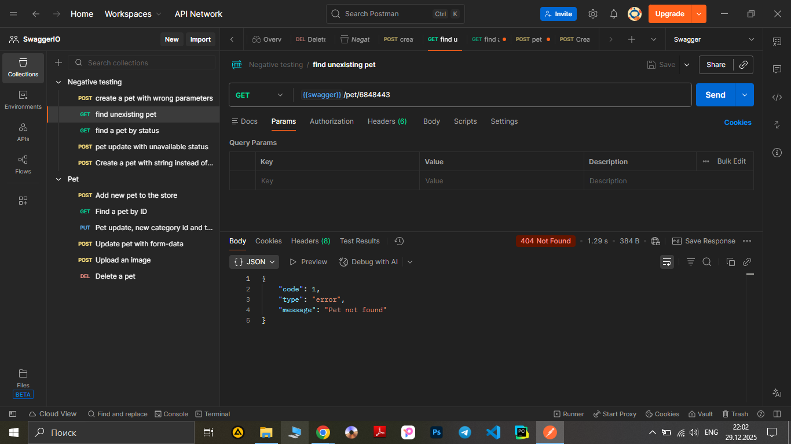

# Test Case ID: TCN_02

## Title:  Find a pet using GET request, with invalid data such as ID.

***Link to [Jira](https://igor2012lww.atlassian.net/browse/SWAG-9?atlOrigin=eyJpIjoiMDcyMzg0OGM4YTM3NDUwODg0YWJjZjdkOTRiZGMwODkiLCJwIjoiaiJ9)*** 

----

- Type of testing: Functional
- Test Object: API
- Test Type: Negative

----

## Preconditions:

1. Postman is installed on computer. 
2. Create an environment with variable "swagger" and put in a link "https://petstore.swagger.io/v2".
3. Create a "Negative testing" folder in Collections.
4. "https://petstore.swagger.io/" is available and opened to check documentation.

## Steps:

1. Add a new request to "Negative testing" folder.
2. Name the request "Find an unexisting pet" 
3. Change method to "GET"
4. Print to URL-field variable {{swager}} and add /pet/6848443 (ID: 6848443 does not exist). 
5. Press the button "Send" observe a response body and status code.

----

## Expected Result:

Code 400 ‘Invalid ID supplied’ or code 404 ‘Pet not found’

## Actual Result:

Code 404 ‘Pet not found’
```json
{
    "code": 1,
    "type": "error",
    "message": "Pet not found"
}
```
----

## Status: Pass

----

## Screenshot: 


