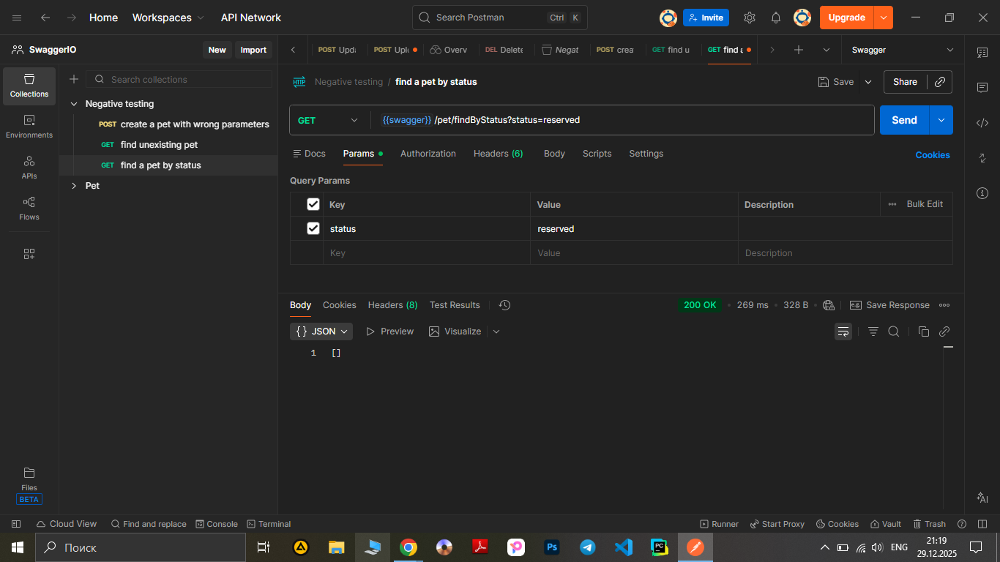

# Test Case ID: TCN_03

## Title: Find a pet by unavailable ‘status’ using a query with method GET.

***Link to [Jira](https://igor2012lww.atlassian.net/browse/SWAG-10?atlOrigin=eyJpIjoiNjkyYzAwMjRlMTliNDcwN2I2MTcxYjI4OTQyY2UwNDAiLCJwIjoiaiJ9)***

----

- Type of testing: Functional
- Test Object: API
- Test Type: Negative

----

## Preconditions:

1. Postman is installed on computer. 
2. Create an environment with variable "swagger" and put in a link "https://petstore.swagger.io/v2".
3. Create a "Negative testing" folder in Collections.
4. "https://petstore.swagger.io/" is available and opened to check documentation.

## Steps:

1. Add a new request to "Negative testing" folder.
2. Name the request “Find a pet by status”.
3. Change method to "GET"
4. Print to URL-field variable {{swager}} and add /pet/findByStatus. 
5. Open the Params tab.
6. In the Query Params section, enter "status" in the Key field and "reserve" in the Value field.
(Note that according to swagger.petstore documentation, there are only 3 available statuses: available, sold, pending) 
5. Press the button "Send" observe a response body and status code.

----

## Expected Result:

Code 400 ‘Invalid status value’

## Actual Result:

Code 200 ‘Request successful. The server has responded as required’

----

## Status: Failed 

----

## Screenshot: 

