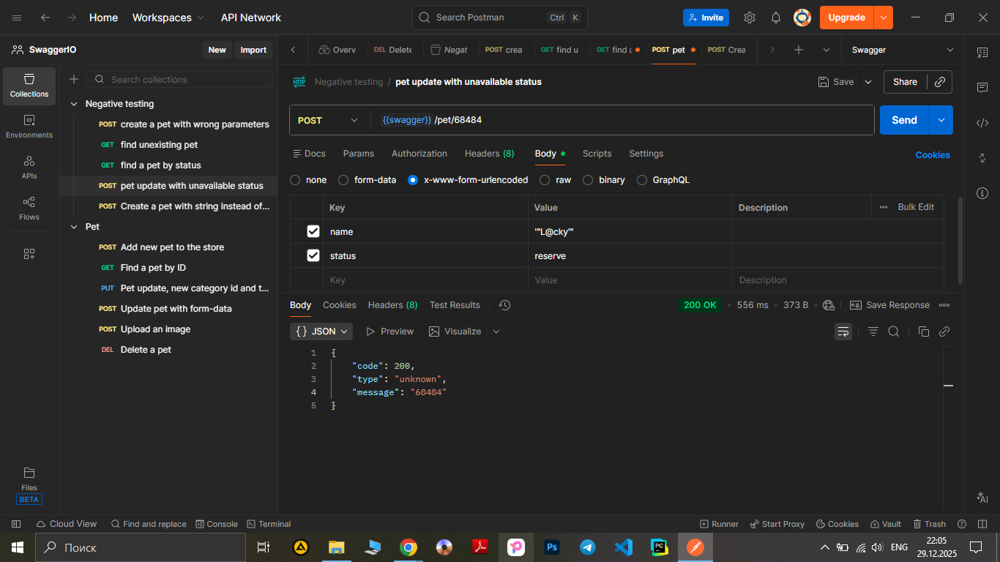

# Test Case ID: TCN_04

## Title: Update a pet using form data with wrong format of name and unavailable status

***Link to [Jira](https://igor2012lww.atlassian.net/browse/SWAG-11?atlOrigin=eyJpIjoiNDAxMmExZGM5ZTE5NGRiYjhmNzRmYzRhNDExNTE2ZTkiLCJwIjoiaiJ9)***
----

- Type of testing: Functional
- Test Object: API
- Test Type: Negative

---

## Preconditions:

1. Postman is installed on computer. 
2. Create an environment with variable "swagger" and put in a link "https://petstore.swagger.io/v2".
3. Create a "Negative testing" folder in Collections.
4. "https://petstore.swagger.io/" is available and opened to check documentation.
5. Pet with ID 68484 exists in the store.

## Steps:

1. Add a new request to "Negative testing" folder.
2. Name the request “Pet update with unavailable status”.
3. Change method to "POST"
4. Print to URL-field variable {{swager}} and add /pet/68484. 
5. Open the Body tab.
6. In the "x-www-form-urlencoded" section, set the following parameters:

- Key: name, Value: '"L@cky'"
- Key: status, Value: reserve

5. Press the button "Send" observe a response body and status code.

----

## Expected Result:

Code 400 ‘Invalid status value’

## Actual Result:

Code 200 'Request successful'
```json
{
    "code": 200,
    "type": "unknown",
    "message": "68484"
}
```

----

## Status: Failed 

----

## Screenshot: 


