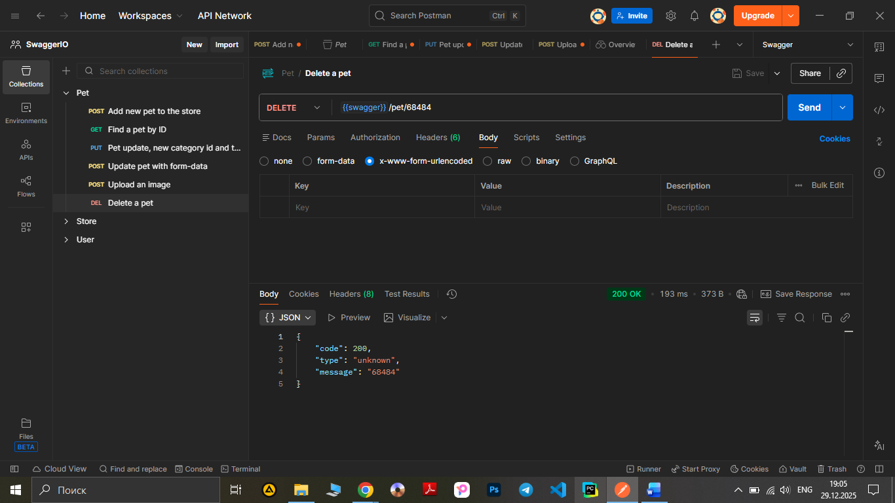

# Test Case ID: TCP_06

## Title: Delete a pet using method DELETE

***Link to [Jira](https://igor2012lww.atlassian.net/browse/SWAG-7?atlOrigin=eyJpIjoiM2I3Zjg1ODFmNzYwNDcyNWI2MWIwMGFiNjA1ZTIwMzYiLCJwIjoiaiJ9)*** 

----

- Type of testing: Functional

- Test Object: API

- Test Type: Positive

----

## Preconditions:

1. Postman is installed on computer. 
2. Create an environment with variable "swagger" and put in a link "https://petstore.swagger.io/v2".
3. Create a "pet" folder in Collections.
4. "https://petstore.swagger.io/" is available and opened to check documentation.
5. Pet with ID 68484 already created.

## Steps:

1. Add a new request to "Pet" folder.
2. Name it "Delete a pet" 
3. Change method to "DELETE"
4. Print to URL-field variable {{swager}} and add /pet/68484
6. Press the button "Send" observe a response body and status code.
7. Check that a request was sucessful, try to find a pet with ID 68484

----

## Expected Result:
Code 200 ‘Successful operation’. The server has responded as required.
Trying to find a pet with ID 68484: Code 404 'Pet not found'

## Actual Result:

Code 200 ‘Successful operation’:
```
{
    "code": 200,
    "type": "unknown",
    "message": "68484"
}
```
The server has responded as required.

404 Not Found:
```
{
    "code": 1,
    "type": "error",
    "message": "Pet not found"
}

```
----

## Status: Pass

----

## Screenshot: 




