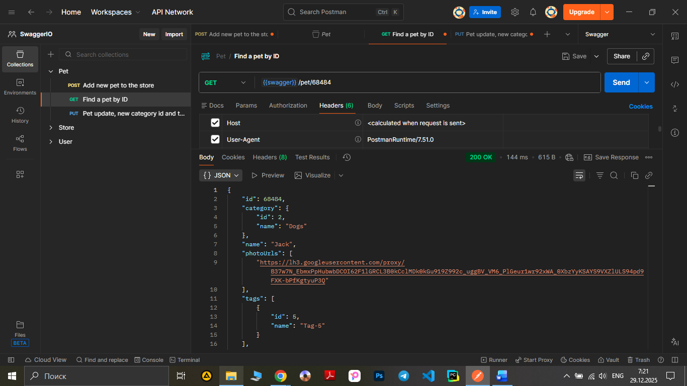

# Test Case ID: TCP_02

## Title: Find a pet by using a GET request with valid pet ID

***Link to [Jira](https://igor2012lww.atlassian.net/browse/SWAG-3?atlOrigin=eyJpIjoiNWUxNjUwNjA1MjRiNDRiMzg1ODQ3MmFjZjEyZTZhY2IiLCJwIjoiaiJ9)*** 

----

- Type of testing: Functional

- Test Object: API

- Test Type: Positive

----

## Preconditions:

1. Postman is installed on computer. 

2. Create an environment with variable "swagger" and put in a link "https://petstore.swagger.io/v2".

3. Create a "pet" folder in Collections.
 
4. "https://petstore.swagger.io/" is available and opened to check documentation.

5. Pet with ID 68484 already created.

## Steps:

1. Add a new request to "Pet" folder.

2. Name the request "Find a pet by ID"

3. Change method to "GET"

4. Print to URL-field variable {{swager}} and add /pet/68484. 

5. Press the button "Send" observe a response body and status code.

## Expected Result:

Code 200 ‘Successful operation’

## Actual Result:

Code 200 ‘Successful operation’. The server has responded as required.

## Status: Pass

----

## Screenshot: 

