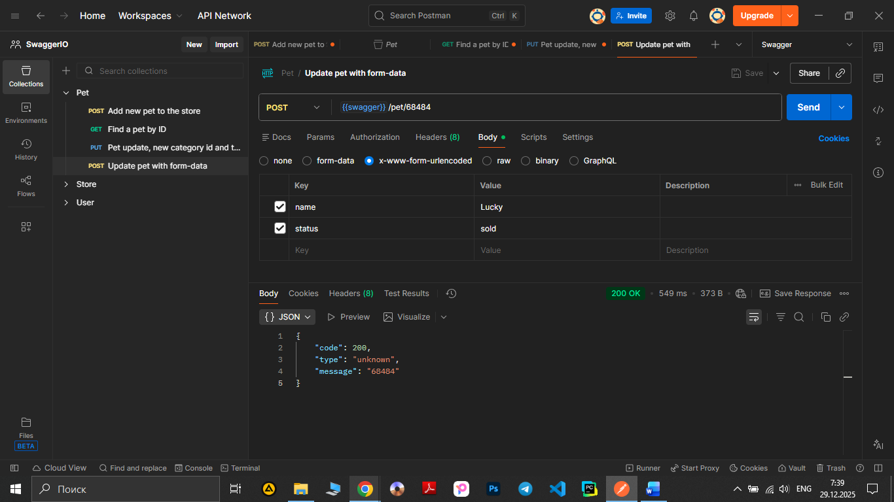

# Test Case ID: TCP_4

## Title: Update a pet in the store with form data using POST method.

***Link to [Jira](https://igor2012lww.atlassian.net/browse/SWAG-5?atlOrigin=eyJpIjoiZGNmYmFmN2I5M2Q0NDBiYzlkOWE5ZGFkYTExZmYxYjUiLCJwIjoiaiJ9)*** 

----

- Type of testing: Functional

- Test Object: API

- Test Type: Positive

----

## Preconditions:

1. Postman is installed on computer. 
2. Create an environment with variable "swagger" and put in a link "https://petstore.swagger.io/v2".
3. Create a "pet" folder in Collections.
4. "https://petstore.swagger.io/" is available and opened to check documentation.
5. Pet with ID 68484 already created.


## Steps:

1. Add a new request to "Pet" folder.
2. Name the request "Update pet with form-data"
3. Change method to "POST"
4. Print to URL-field variable {{swager}} and add /pet/68484. 
5. Open the Body tab, chose "x-www-form-urlencoded" and enter the following data into the form, fill in two rows(IMPORTANT NOTE:Swagger Petstore describes form parameters, not multipart requests.

Actual supported media type is application/x-www-form-urlencoded):

- Key: name, Value: Lucky
- Key: status, Value: sold 

6. Press the button "Send" observe a response body and status code.
7. Re-check the new data in object, find a pet with ID "68484" using a method GET.

----

## Expected Result:
Code 200 ‘Successful operation’. The request body has been updated with the new parameter values.

## Actual Result:

Code 200 ‘Successful operation’.
```
{
    "code": 200,
    "type": "unknown",
    "message": "68484"
}
```

The server has responded as required. The request body has been updated with the new parameter values.

----

## Status: Pass

----

## Screenshot: 


