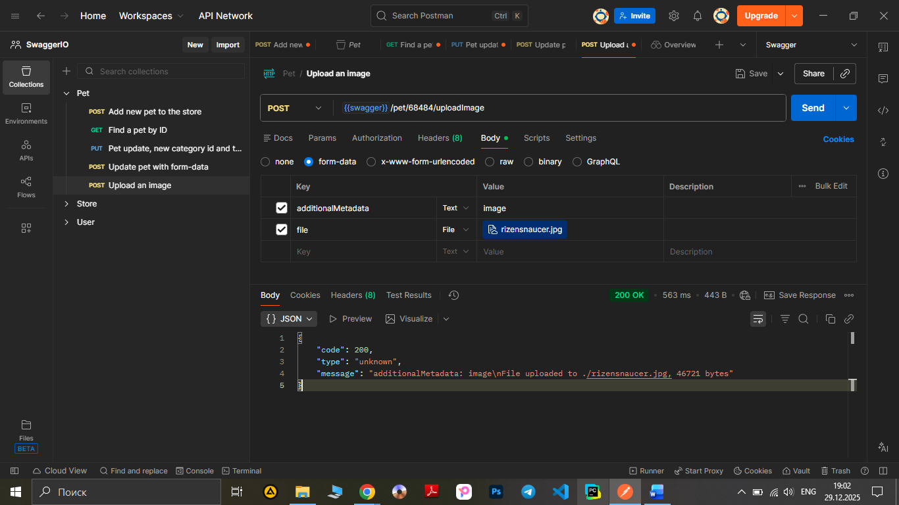

# Test Case ID: TCP_05

## Title: Upload an image for existing pet, using method POST.

***Link to [Jira](https://igor2012lww.atlassian.net/browse/SWAG-6?atlOrigin=eyJpIjoiMDY1OGJlNjcyM2FlNDBkNTk2YjYyM2Y5ODI1MWE1NDgiLCJwIjoiaiJ9)*** 

----

- Type of testing: Functional

- Test Object: API

- Test Type: Positive

----

## Preconditions:

1. Postman is installed on computer. 
2. Create an environment with variable "swagger" and put in a link "https://petstore.swagger.io/v2".
3. Create a "pet" folder in Collections.
4. "https://petstore.swagger.io/" is available and opened to check documentation.
5. Pet with ID 68484 already created.

## Steps:

1. Add a new request to "Pet" folder.
2. Name the request "Upload an image" 
3. Change method to "POST"
4. Print to URL-field variable {{swager}} and add /pet/68484/uploadImage
5. Open the Body tab.
6. Chose "form-data" and enter the following data into the form:

- Key: additionalMetadata, Value: image (type of key is a text)
- Key: file, Value: a file from a local computer (type of key is a file)

7. Press the button "Send" observe a response body and status code.

----

## Expected Result:
Code 200 ‘Successful operation’. The server has responded as required.

## Actual Result:

Code 200 ‘Successful operation’.
```json
{
    "code": 200,
    "type": "unknown",
    "message": "additionalMetadata: image\nFile uploaded to ./rizensnaucer.jpg, 46721 bytes"
}
```
The server has responded as required.

----

## Status: Pass

----

## Screenshot: 


