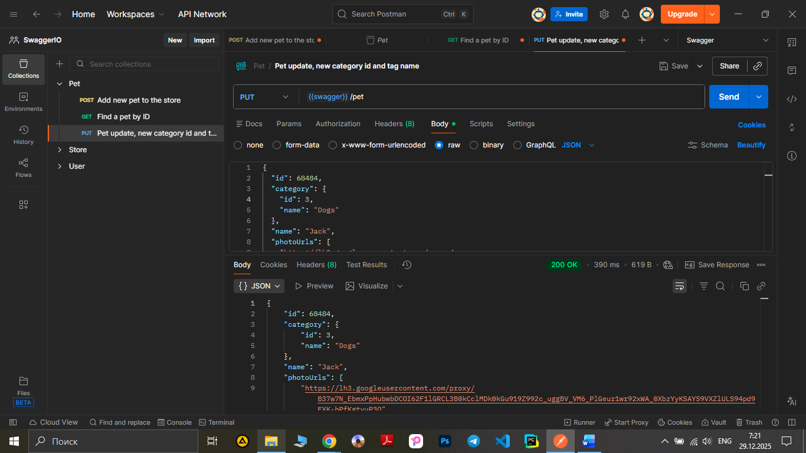

# Test Case ID: TCP_03

## Title: Update a pet using method PUT, add new ‘category’ ID and category name.

***Link to [Jira](https://igor2012lww.atlassian.net/browse/SWAG-4?atlOrigin=eyJpIjoiNjMzYjA0NDI5YTZmNGJiZmEyNDJlNDc1NGQxMzBiYzciLCJwIjoiaiJ9)*** 

----

- Type of testing: Functional

- Test Object: API

- Test Type: Positive

----

## Preconditions:

1. Postman is installed on computer. 

2. Create an environment with variable "swagger" and put in a link "https://petstore.swagger.io/v2".

3. Create a "pet" folder in Collections.

4. "https://petstore.swagger.io/" is available and opened to check documentation.

5. Pet with ID 68484 already created.

## Steps:

1. Add a new request to "Pet" folder.

2. Name the request "Pet update, new category id and tag name"

3. Change method to "PUT"

4. Print to URL-field variable {{swager}} and add /pet . 

5.Open body, chose "raw" and paste an object:

 ```
{
  "id": 68484,
  "category": {
    "id": 3,
    "name": "Dogs"
  },
  "name": "Jack",
  "photoUrls": [
    "https://lh3.googleusercontent.com/proxy/B37w7N_EbmxPpHubwbDCOI62F1lGRCL3B0kCclMDk0kGu919Z992c_uggBV_VM6_PlGeur1wr92xWA_0XbzYyKSAYS9VXZlULS94pd9FXK-bPfKgtyuP3Q"
  ],
  "tags": [
    {
      "id": 5,
      "name": "home pets"
    }
  ],
  "status": "available"
}
```

6. Press the button "Send" observe a response body and status code.

7. Re-check the new data in object, find a pet with ID "68484" using a method GET.

----

## Expected Result:
Code 200 ‘Successful operation’. The request body has been updated with the new parameter values.

## Actual Result:

Code 200 ‘Successful operation’. The server has responded as required. The request body has been updated with the new parameter values.

----

## Status: Pass

----

## Screenshot: 


